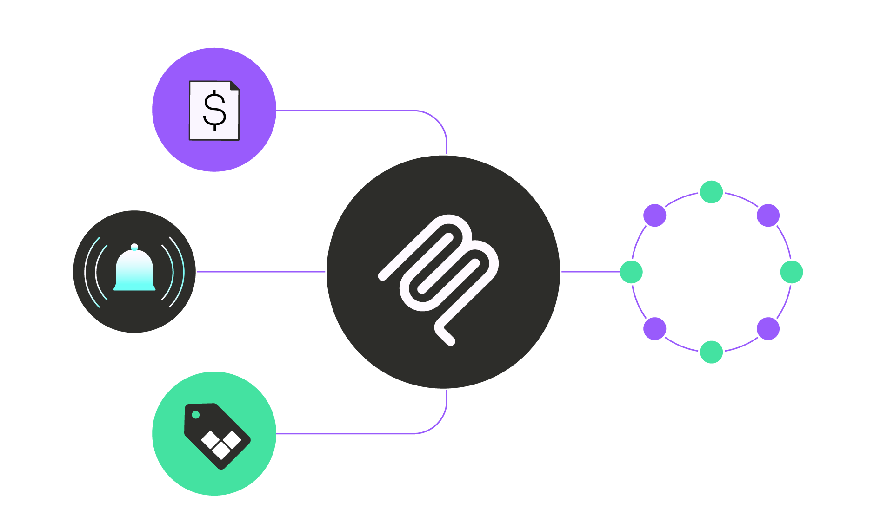

<div align="center">

# Vantage MCP Server

<h4>Use natural language to explore your organization’s cloud costs via MCP clients, like Claude, Cursor, and others. Ask questions about your organization's previous and current cloud cost spend, cost tagging, provider integrations, and more.</h4>



</div>

## About the Vantage MCP Server

The Vantage MCP Server is an open-source tool, written in Golang, that lets you interact with your cloud cost data through AI assistants and MCP clients. By acting as a bridge to Vantage's existing APIs, the Vantage MCP Server lets you query cloud spend data using natural language and makes cost analysis more intuitive.

> 📝 _Note: The Vantage MCP Server is available in both self-hosted and remote forms. This repository supports the self-hosted version, which runs locally using [Standard Input/Output (stdio) Transport](https://modelcontextprotocol.io/docs/concepts/transports#standard-input%2Foutput-stdio). For a remote alternative, see the [Vantage MCP documentation](https://docs.vantage.sh/vantage_mcp)._

### Available Tools

The Vantage MCP Server currently exposes the following tools, which can be invoked by any compatible MCP client (e.g., Claude, Cursor, Goose):

- `query-costs`
  - A general purpose way to fetch Cost data using VQL.

- `list-costs`

  - Display all the Costs in an associated Cost Report.

- `list-cost-reports`

  - List all Cost Reports available.

- `get-cost-report-forecast`

  - List all Forecasts of spending related to a Cost Report.

- `list-cost-integrations`

  - List all Cost Provider integrations (e.g., AWS, Azure, GCP) available to provide Costs data from and their associated accounts.

- `list-cost-providers`
  - List of just the Providers that the given Workspace has shared with it.

- `list-cost-services`
  - Lists all the Services and their associated Provider that is shared with the given Workspace.

- `list-budgets`
  - List all Budgets available to compare against a Cost Report and track spending.

- `list-dashboards`
  - List all Dashboards created in the Vantage account.

- `list-tags`

  - List Tags that can be used to filter Cost Reports.

- `list-tag-values`

  - List Tag values that can be used to filter Cost Reports.

- `list-anomalies`
  - List Anomalies that were detected on Cost Reports.

- `list-cost-providers`
  - List Cost Providers that can be used to filter Costs in VQL queries.

- `list-unit-costs`
  - Retrieve the Unit Costs for a given Cost Report.

- `get-myself`
  - A utility to list available Workspaces and check the access level of your auth token.

- `submit-user-feedback`
  - A simple way to send feedback about the MCP or overall Vantage experience to the Vantage team.

## Getting Started

### Prerequisites

If you're installing from source, ensure the following packages are installed (see `.tool-versions` for exact versions):

- [Go](https://go.dev/doc/install)
- [Node.js](https://nodejs.org/en/download)

You can use a version manager (e.g., [`asdf`](https://asdf-vm.com/)) or package manager (e.g., [Homebrew](https://brew.sh/)) to install these dependencies.

You will also need to create a **Read-Only** Vantage API token (Write will not work at this time). Follow the instructions on the [Vantage API documentation](https://vantage.readme.io/reference/authentication). We recommend creating a brand-new read-only API token for exclusive use with the MCP Server.

### Installation

#### Using Homebrew

```bash
brew install vantage-sh/tap/vantage-mcp-server
```

#### From Source

1. Clone this repository.

```bash
git clone https://github.com/vantage-sh/vantage-mcp-server
```

2. Build the server and adjust permissions.

```bash
go build -o vantage-mcp-server
chmod +x vantage-mcp-server
```

> 📝 _Note: If you pull down new changes from the repository, be sure to re-run `go build` to rebuild the server and ensure you're running the latest version._

3. Debug using the MCP inspector.

```bash
npx @modelcontextprotocol/inspector -e VANTAGE_BEARER_TOKEN=<token> ./vantage-mcp-server
```

### Set Up MCP Clients

Setup instructions vary depending on which MCP client you use. Example clients include:

- [Claude for Desktop](https://modelcontextprotocol.io/quickstart/user)
- [Cursor](https://docs.cursor.com/context/model-context-protocol)
- [Goose](https://block.github.io/goose/)

See the [MCP documentation](https://modelcontextprotocol.io/clients) for a list of available clients. Detailed instructions for Claude for Desktop, Cursor, and Goose are provided below.

#### Claude for Desktop

1. Download [Claude for Desktop](https://claude.ai/download).
2. From the top of Claude for Desktop, click **Claude > Settings** (keyboard shortcut `Command + ,`).
3. In the left menu of the Settings pane, select **Developer**.
4. Click **Edit Config**. A configuration file is created at:

- **macOS**: `~/Library/Application Support/Claude/claude_desktop_config.json`
- **Windows**: `%APPDATA%\Claude\claude_desktop_config.json`

5. Open the `claude_desktop_config.json` file and update its contents. Make sure to replace the placeholders `<path_to_compiled_vantage_mcp_server_binary>` with the path where you downloaded the Vantage MCP Server binary, and `<personal_vantage_api_token>` with your Vantage API token.

   ```json
   {
     "mcpServers": {
       "Vantage": {
         "command": "<path_to_compiled_vantage_mcp_server_binary>",
         "args": [],
         "env": { "VANTAGE_BEARER_TOKEN": "<personal_vantage_api_token>" }
       }
     }
   }
   ```

6. Save the configuration file and restart Claude.
7. In the bottom-right corner of the Claude for Desktop input box, click the hammer icon to see the available tools for the Vantage MCP Server.
8. Once you've set up the configuration, you can start prompting Claude. Each time you use a new tool, Claude will ask for your approval before proceeding.

#### Cursor

1. Download [Cursor](https://www.cursor.com).
2. Open Cursor and click **Cursor > Settings > Cursor Settings** from the menu bar.
3. In the left pane, select **MCP**.
4. Click **Add new global MCP Server**.
5. Update the contents of the opened `mcp.json` file. Make sure to replace the placeholders `<path_to_compiled_vantage_mcp_server_binary>` with the path where you downloaded the Vantage MCP Server binary, and `<personal_vantage_api_token>` with your Vantage API token.

   ```json
   {
     "mcpServers": {
       "Vantage": {
         "command": "<path_to_compiled_vantage_mcp_server_binary>",
         "args": [],
         "env": { "VANTAGE_BEARER_TOKEN": "<personal_vantage_api_token>" }
       }
     }
   }
   ```

#### Goose

1. Download [Goose](https://block.github.io/goose/).
2. Open Goose and click **Goose > Settings** from the menu bar (keyboard shortcut `Command + ,`).
3. Under the **Extensions** section, click **Add custom extension**.
4. In the **ID** field, enter `vantage-mcp-server`.
5. In the **Name** field, enter `Vantage`.
6. In the **Description** field, enter `Query costs and usage data`.
7. In the **Command** field, enter the path to the Vantage MCP Server binary.
8. In the **Environment Variables** section, add a new variable with the name `VANTAGE_BEARER_TOKEN` and the value set to your Vantage API token.
9. Click **Add**.

#### Note for MacOS users

If you download a release from our Github page and the executable fails to run "because the developer cannot be verified", please open your System Settings. Then find the "Privacy and Security" section. Then scroll to the bottom and you should see a message that "vantage-mcp-server-macos" was blocked, click the "open anyway" button. After this flow, the executable should be able to be run without issue.

## Contribution Guidelines

If you'd like to contribute to this project:

1. Fork this repository.
2. Create a new branch: `git checkout -b feature/my-feature`.
3. Make your changes.
4. Ensure your code is formatted and builds cleanly.
5. Submit a [pull request](https://github.com/vantage-sh/vantage-mcp-server/pulls).

We welcome community contributions, improvements, and bug fixes. If you run into any issues, submit a bug report via this repository's [GitHub Issues](https://github.com/vantage-sh/vantage-mcp-server/issues).

## License

See the `LICENSE.MD` file for commercial and non-commercial licensing details.
