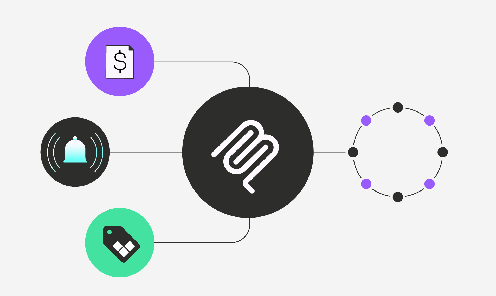

<div align="center">

# Vantage MCP Server


</div> 


```
go build -o vantage-mcp-server
chmod +x vantage-mcp-server
```

For a faster feedback loop, run using the MCP inspector:
```
npx @modelcontextprotocol/inspector -e VANTAGE_BEARER_TOKEN=<token> ./vantage-mcp-server
```

### Setting up MCP Server

1. Follow the instructions at https://modelcontextprotocol.io/quickstart/user

`claude_desktop_config.json` should look like:
```
{
  "mcpServers": {
    "Vantage": {
      "command": "<path_to_compiled_vantage_mcp_server_binary>",
      "args": [],
      "env": {"VANTAGE_BEARER_TOKEN": "<personal_vantage_api_token>"}
    }
  }
}
```
