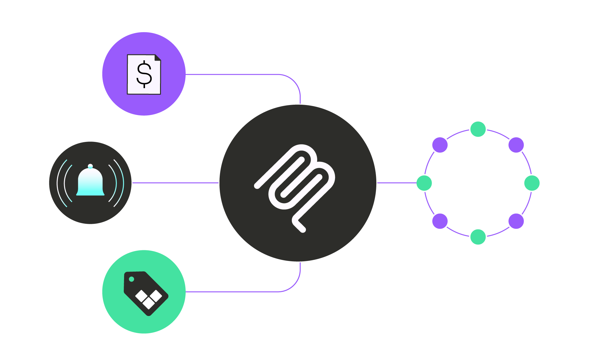

<div align="center">

# Vantage MCP Server

<h4>Use natural language to explore your organization's cloud costs via MCP clients, like Claude, Cursor, and others. Ask questions about your organization's previous and current cloud cost spend, cost tagging, provider integrations, and more.</h4>



</div>

## About

The Vantage MCP Server exposes tools for listing, querying, and creating Vantage resources. Tools are defined in [/src/tools](/src/tools); see the [Vantage MCP documentation](https://docs.vantage.sh/vantage_mcp) for the full tool list, prompting examples, and product details.

This repository supports two deployment modes:

| Mode | Best for |
| ---- | -------- |
| **Hosted (Remote) MCP** — Vantage-managed at `https://mcp.vantage.sh/mcp` | Most users and teams. OAuth sign-in, no local server to run. |
| **Self-Hosted (Local) MCP** — stdio via `npx -y vantage-mcp-server` or this repo | API-token auth, air-gapped environments, or contributing to this codebase. |

**Start with the hosted MCP** unless you have a specific reason to self-host.

## Setup Instructions

### General

The hosted MCP server uses [Streamable HTTP](https://modelcontextprotocol.io/specification/2025-06-18/basic/transports#streamable-http) with OAuth 2.1. After connecting a client, a browser window prompts you to sign in to Vantage — the same account you use at [console.vantage.sh](https://console.vantage.sh/).

**Server URL:** `https://mcp.vantage.sh/mcp`

Clients that support remote MCP natively can connect directly to that URL. For clients that only support stdio, use the `mcp-remote` bridge (see [Visual Studio Code](#visual-studio-code) below).

**API token auth:** If your client or script cannot complete OAuth, pass a [Vantage API token](https://docs.vantage.sh/vantage_account#create-an-api-token) as a Bearer token instead:

```http
Authorization: Bearer <your_vantage_api_token>
```

### Claude Code

```bash
claude mcp add --transport http vantage https://mcp.vantage.sh/mcp
```

Then run `/mcp` in a Claude Code session to complete the OAuth flow.

### Codex

```bash
codex mcp add vantage --url https://mcp.vantage.sh/mcp
```

Run `codex mcp login vantage` if Codex prompts you to authenticate.

### Cursor

The recommended install is the official Vantage plugin — in the Cursor chat panel, run:

```
/add-plugin vantage
```

To configure manually (for example, to commit `.cursor/mcp.json` to a repo):

```json
{
  "mcpServers": {
    "VantageMCP": {
      "url": "https://mcp.vantage.sh/mcp"
    }
  }
}
```

Open **Cursor Settings → Tools & MCP → New MCP Server** to edit `mcp.json`, or create `.cursor/mcp.json` in your project root.

### Claude

**Claude.ai (Team / Enterprise):** **Settings → Connectors → Add custom connector** — enter `https://mcp.vantage.sh/mcp`.

**Claude Desktop:** **Settings → Connectors** — add a custom connector with the same URL.

### Goose

1. **Extensions → Add custom extension**
2. **Type:** Streamable HTTP
3. **Endpoint:** `https://mcp.vantage.sh/mcp`

Complete the OAuth flow when Goose connects.

### Visual Studio Code

```json
{
  "mcpServers": {
    "vantage": {
      "command": "npx",
      "args": ["-y", "mcp-remote", "https://mcp.vantage.sh/mcp"]
    }
  }
}
```

Or use the command palette: **MCP: Add Server → Command (stdio)** and enter:

```bash
npx -y mcp-remote https://mcp.vantage.sh/mcp
```

### Windsurf

Under **Cascade → MCP servers → Add custom server**, add:

```json
{
  "mcpServers": {
    "vantage": {
      "command": "npx",
      "args": ["-y", "mcp-remote", "https://mcp.vantage.sh/mcp"]
    }
  }
}
```

### Zed

In Zed settings, add:

```json
{
  "context_servers": {
    "vantage": {
      "source": "custom",
      "command": "npx",
      "args": ["-y", "mcp-remote", "https://mcp.vantage.sh/mcp"],
      "env": {}
    }
  }
}
```

### Other clients

For any stdio-only MCP client, use:

- **Command:** `npx`
- **Arguments:** `-y mcp-remote https://mcp.vantage.sh/mcp`

See the [MCP clients list](https://modelcontextprotocol.io/clients) and the [Vantage MCP documentation](https://docs.vantage.sh/vantage_mcp) for additional clients (including ChatGPT via the Vantage app).

### Authorize

After configuring your client, you may need to restart it. A browser window opens for Vantage OAuth — sign in and click **Allow Access**. You can revoke access anytime under **Vantage Settings → API Access Tokens → MCP Server Token**.

Try a prompt like: *"In Vantage, which workspaces do I have access to?"*

---

## Self-Hosted (Local) MCP

Use self-hosted mode when you need API-key auth without OAuth, or when developing against this repository.

### npm package (recommended for self-host)

Install nothing — configure your MCP client to run the published package:

```json
{
  "mcpServers": {
    "Vantage": {
      "command": "npx",
      "args": ["-y", "vantage-mcp-server"],
      "env": {
        "VANTAGE_TOKEN": "<your_vantage_api_token>"
      }
    }
  }
}
```

Create a token in the [Vantage console](https://docs.vantage.sh/vantage_account#create-an-api-token). Requires [Node.js 20+](https://nodejs.org/en/download).

### From this repository (contributors)

For working on the MCP server itself:

```bash
git clone https://github.com/vantage-sh/vantage-mcp-server
cd vantage-mcp-server
npm install
```

Configure your client to run the local entrypoint (replace `<path_to_repository>` and `<personal_vantage_api_token>`):

```json
{
  "mcpServers": {
    "Vantage": {
      "command": "npx",
      "args": ["tsx", "<path_to_repository>/src/local.ts"],
      "env": { "VANTAGE_TOKEN": "<personal_vantage_api_token>" }
    }
  }
}
```

Or use the repo's installed binary directly:

```json
{
  "mcpServers": {
    "Vantage": {
      "command": "<path_to_repository>/node_modules/.bin/tsx",
      "args": ["<path_to_repository>/src/local.ts"],
      "env": { "VANTAGE_TOKEN": "<personal_vantage_api_token>" }
    }
  }
}
```

Test from the terminal: `npm run local` (requires `VANTAGE_TOKEN` in the environment).

---

## Local Development

To develop the hosted worker locally:

```bash
cp .dev.vars.example .dev.vars.development
# Edit .dev.vars.development — set VANTAGE_MCP_TOKEN to your API token
npm run dev
```

Wrangler serves the worker at `http://localhost:8787` (default). Setting `VANTAGE_MCP_TOKEN` bypasses OAuth for local testing.

---

## Running Evals

**New tools** must ship with an eval file under `evals/<tool>.eval.ts` (or `evals/<resource>/<tool>.eval.ts`). See `.agents/skills/writing-evals/SKILL.md` (tool authoring: `.agents/skills/writing-mcp-tools/SKILL.md`).

```bash
npm run eval -- ./evals/<...>/<your-tool>.eval.ts
```

Commit the updated `evals/evalite.db` alongside the tool change. Evals are not run in CI.

Browse results locally: `npm run eval:export && open ./evalite-export/index.html`. A live UI is published at <https://vantage-sh.github.io/vantage-mcp-server/>.

---

## Available Scripts

- `npm run dev` — Start the Wrangler development server
- `npm run local` — Run the stdio MCP server locally
- `npm run inspect` — Launch the MCP inspector
- `npm run test` — Run Vitest
- `npm run format` / `npm run lint:fix` — Biome format and lint
- `npm run type-check` — TypeScript check
- `npm run cf-typegen` — Generate Cloudflare Worker types
- `npm run generate-tools-index` — Regenerate `src/tools/index.ts` after tool changes
- `npm run generate-resources-index` — Regenerate `src/resources/index.ts` after resource changes
- `npm run eval` — Run evals (`npm run eval -- ./evals/<path>` for one file)
- `npm run eval:dev` — Evalite watch mode with UI on `localhost:3006`
- `npm run eval:export` — Static HTML bundle from `evals/evalite.db`

---

## Contribution Guidelines

1. Fork this repository and create a branch: `git checkout -b feature/my-feature`.
2. Make your changes.
3. Verify locally:
   ```bash
   npm run format
   npm run lint:fix
   npm run type-check
   npm test -- --run
   ```
4. Submit a [pull request](https://github.com/vantage-sh/vantage-mcp-server/pulls).

See [AGENTS.md](/AGENTS.md) for conventions when adding tools, evals, or resources.

---

## License

See [LICENSE.md](LICENSE.md) for commercial and non-commercial licensing details.
