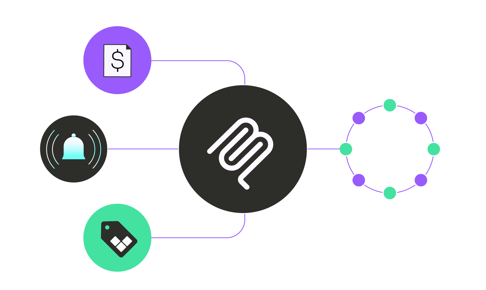

<div align="center">

# Vantage MCP Server

<h4>Use natural language to explore your organization's cloud costs via MCP clients, like Claude, Cursor, and others. Ask questions about your organization's previous and current cloud cost spend, cost tagging, provider integrations, and more.</h4>



</div>

## About

The Vantage MCP Server exposes tools for listing, querying, and creating Vantage resources. Tools are defined in [/src/tools](/src/tools); see the [Vantage MCP documentation](https://docs.vantage.sh/vantage_mcp) for the full tool list, prompting examples, and product details.

This repository supports two deployment modes:

| Mode                                                                             | Best for                                                                   |
| -------------------------------------------------------------------------------- | -------------------------------------------------------------------------- |
| **Hosted (Remote) MCP** — Vantage-managed at `https://mcp.vantage.sh/mcp`        | Most users and teams. OAuth sign-in, no local server to run.               |
| **Self-Hosted (Local) MCP** — stdio via `npx -y vantage-mcp-server` or this repo | API-token auth, air-gapped environments, or contributing to this codebase. |

**Start with the hosted MCP** unless you have a specific reason to self-host.

## Setup Instructions

### General

The hosted MCP server uses [Streamable HTTP](https://modelcontextprotocol.io/specification/2025-06-18/basic/transports#streamable-http) with OAuth 2.1. After connecting a client, a browser window prompts you to sign in to Vantage — the same account you use at [console.vantage.sh](https://console.vantage.sh/).

**Server URL:** `https://mcp.vantage.sh/mcp`

**Legacy SSE connections:** The `/sse` endpoint is deprecated and remains available during the 60-day migration
window, ending on **November 30, 2026**, when the legacy SSE endpoint will be retired. If your client uses
`https://mcp.vantage.sh/sse`, update its server URL to `https://mcp.vantage.sh/mcp`, select Streamable HTTP if it asks
for a transport, then reconnect and sign in if prompted. Some clients display a deprecation warning when connecting;
others do not.

Clients that support remote MCP natively can connect directly to that URL. For clients that only support stdio, use the `mcp-remote` bridge (see [Visual Studio Code](#visual-studio-code) below).

**API token auth:** If your client or script cannot complete OAuth, pass a [Vantage API token](https://docs.vantage.sh/vantage_account#create-an-api-token) as a Bearer token instead:

```http
Authorization: Bearer <your_vantage_api_token>
```

### Claude Code

```bash
claude mcp add --transport http vantage https://mcp.vantage.sh/mcp
```

Then run `/mcp` in a Claude Code session to complete the OAuth flow.

### Codex

```bash
codex mcp add vantage --url https://mcp.vantage.sh/mcp
```

Run `codex mcp login vantage` if Codex prompts you to authenticate.

### Cursor

The recommended install is the official Vantage plugin — in the Cursor chat panel, run:

```
/add-plugin vantage
```

To configure manually (for example, to commit `.cursor/mcp.json` to a repo):

```json
{
  "mcpServers": {
    "VantageMCP": {
      "url": "https://mcp.vantage.sh/mcp"
    }
  }
}
```

Open **Cursor Settings → Tools & MCP → New MCP Server** to edit `mcp.json`, or create `.cursor/mcp.json` in your project root.

### Claude

**Claude.ai (Team / Enterprise):** **Settings → Connectors → Add custom connector** — enter `https://mcp.vantage.sh/mcp`.

**Claude Desktop:** **Settings → Connectors** — add a custom connector with the same URL.

### Goose

1. **Extensions → Add custom extension**
2. **Type:** Streamable HTTP
3. **Endpoint:** `https://mcp.vantage.sh/mcp`

Complete the OAuth flow when Goose connects.

### Visual Studio Code

```json
{
  "mcpServers": {
    "vantage": {
      "command": "npx",
      "args": ["-y", "mcp-remote", "https://mcp.vantage.sh/mcp"]
    }
  }
}
```

Or use the command palette: **MCP: Add Server → Command (stdio)** and enter:

```bash
npx -y mcp-remote https://mcp.vantage.sh/mcp
```

### Windsurf

Under **Cascade → MCP servers → Add custom server**, add:

```json
{
  "mcpServers": {
    "vantage": {
      "command": "npx",
      "args": ["-y", "mcp-remote", "https://mcp.vantage.sh/mcp"]
    }
  }
}
```

### Zed

In Zed settings, add:

```json
{
  "context_servers": {
    "vantage": {
      "source": "custom",
      "command": "npx",
      "args": ["-y", "mcp-remote", "https://mcp.vantage.sh/mcp"],
      "env": {}
    }
  }
}
```

### Other clients

For any stdio-only MCP client, use:

- **Command:** `npx`
- **Arguments:** `-y mcp-remote https://mcp.vantage.sh/mcp`

See the [MCP clients list](https://modelcontextprotocol.io/clients) and the [Vantage MCP documentation](https://docs.vantage.sh/vantage_mcp) for additional clients (including ChatGPT via the Vantage app).

### Authorize

After configuring your client, you may need to restart it. A browser window opens for Vantage OAuth — sign in and click **Allow Access**. You can revoke access anytime under **Vantage Settings → API Access Tokens → MCP Server Token**.

Try a prompt like: _"In Vantage, which workspaces do I have access to?"_

---

## Self-Hosted (Local) MCP

Use self-hosted mode when you need API-key auth without OAuth, or when developing against this repository.

### npm package (recommended for self-host)

Install nothing — configure your MCP client to run the published package:

```json
{
  "mcpServers": {
    "Vantage": {
      "command": "npx",
      "args": ["-y", "vantage-mcp-server"],
      "env": {
        "VANTAGE_TOKEN": "<your_vantage_api_token>"
      }
    }
  }
}
```

Create a token in the [Vantage console](https://docs.vantage.sh/vantage_account#create-an-api-token). Requires [Node.js 20+](https://nodejs.org/en/download).

### From this repository (contributors)

For working on the MCP server itself:

```bash
git clone https://github.com/vantage-sh/vantage-mcp-server
cd vantage-mcp-server
npm install
```

Configure your client to run the local entrypoint (replace `<path_to_repository>` and `<personal_vantage_api_token>`):

```json
{
  "mcpServers": {
    "Vantage": {
      "command": "npx",
      "args": ["tsx", "<path_to_repository>/src/local.ts"],
      "env": { "VANTAGE_TOKEN": "<personal_vantage_api_token>" }
    }
  }
}
```

Or use the repo's installed binary directly:

```json
{
  "mcpServers": {
    "Vantage": {
      "command": "<path_to_repository>/node_modules/.bin/tsx",
      "args": ["<path_to_repository>/src/local.ts"],
      "env": { "VANTAGE_TOKEN": "<personal_vantage_api_token>" }
    }
  }
}
```

Test from the terminal: `npm run local` (requires `VANTAGE_TOKEN` in the environment).

---

## Local Development

To develop the hosted worker locally:

```bash
cp .dev.vars.example .dev.vars.development
# Edit .dev.vars.development — set VANTAGE_MCP_TOKEN to your API token
npm run dev
```

Wrangler serves the worker at `http://localhost:8787` (default). Setting `VANTAGE_MCP_TOKEN` bypasses OAuth for local testing.

---

## Running Evals

Each tool is tested with one direct prompt and one inferred prompt. Both runs load the target tool plus four distractors, then the same cases can be replayed across models. Outcomes are committed as JSON so we do not re-run the whole suite; GitHub Pages rebuilds the report from those files. The approach and full workflow are in [evals.md](evals.md).

**New tools** must ship with cases under `evals/cases/<resource>/<tool>.eval.ts`. Authoring conventions: [`.agents/skills/writing-evals/SKILL.md`](.agents/skills/writing-evals/SKILL.md).

### View outcomes locally

```bash
npm run eval:site
open evals/site/index.html
```

No model API keys required. The published report is at <https://vantage-sh.github.io/vantage-mcp-server/>.

### Run a new eval

Set `ANTHROPIC_API_KEY` and/or `OPENAI_API_KEY` in `.env`, then:

```bash
npm run eval -- --tool <your-tool> --model gpt-5.6-sol-high
```

`--model` is required (`npm run eval -- --list-models` prints the catalog). That writes `evals/results/<model>/<resource>/<tool>.json` and leaves every other result file untouched. Commit the new JSON.

### Overwrite an eval

Re-run the same `--tool` and `--model`. The JSON for that pair is replaced. Do this after changing a tool's description, schema, or prompts — you do not need to re-run every model unless you want those baselines refreshed too.

---

## Available Scripts

- `npm run dev` — Start the Wrangler development server
- `npm run local` — Run the stdio MCP server locally
- `npm run inspect` — Launch the MCP inspector
- `npm run test` — Run Vitest
- `npm run format` / `npm run lint:fix` — Biome format and lint
- `npm run type-check` — TypeScript check
- `npm run cf-typegen` — Generate Cloudflare Worker types
- `npm run generate-tools-index` — Regenerate `src/tools/index.ts` after tool changes
- `npm run generate-resources-index` — Regenerate `src/resources/index.ts` after resource changes
- `npm run eval` — Run tool-selection evals (`npm run eval -- --tool <name> --model gpt-5.6-sol-high`)
- `npm run eval:site` — Merge stored JSON and write `evals/site/index.html`
- `npm run eval:view` — Open promptfoo's local results viewer

---

## Contribution Guidelines

1. Fork this repository and create a branch: `git checkout -b feature/my-feature`.
2. Make your changes.
3. Verify locally:
   ```bash
   npm run format
   npm run lint:fix
   npm run type-check
   npm test -- --run
   ```
4. Submit a [pull request](https://github.com/vantage-sh/vantage-mcp-server/pulls).

See [AGENTS.md](/AGENTS.md) for conventions when adding tools, evals, or resources.

---

## License

See [LICENSE.md](LICENSE.md) for commercial and non-commercial licensing details.

## Tool request cancellation and tracing (ENG-2838 groundwork)

Local stdio, the in-memory protocol tests, and current-release version tooling use
the split MCP SDK v2 packages. Hosted `McpAgent` and its SSE compatibility tests
retain SDK v1 until the hosted stateless migration and SSE retirement. Shared
registration accepts definitions and request data from either SDK; server,
client, and transport objects stay within their own SDK version. Version tooling
enumerates tagged releases inside a bundle using the tag's SDK and returns only
the tool catalog. The v2 JSON Schema dialect change can trigger a minor version
bump on the first comparison against a v1 release.

Tool handlers pass the MCP SDK's per-request abort signal to Core fetches in both hosted
and local stdio modes. Cancellation stops a pending fetch and prevents later API calls
within that tool request. Each request gets its own context and signal, so cancelling one
call does not cancel another. Cancellation is best effort: it cannot undo a mutation
already accepted by Core.

Tool spans prefer valid W3C `traceparent`/`tracestate` from MCP request `_meta`, falling
back to HTTP trace headers when metadata has no valid parent. This also enables tracing
for stdio clients. Tool spans include `mcp.method.name=tools/call` and the existing tool
name. Other metadata and baggage are not copied into Core headers or log attributes.

The existing hosted McpAgent path remains on SDK v1. Validate real hosted and stdio
client cancellation on staging before rollout.

## Stateless hosted MCP (ENG-2834 draft)

`MCP_STATELESS_ENABLED=true` opts `/mcp` into the SDK v2 web-standard
`createMcpHandler`. The flag is unset by default and no Wrangler environment enables
it. The handler creates a fresh server per HTTP exchange, uses the authentication
provider's validated props, and preserves Core logging, tracing, resources, and
owner-only tool gating. The existing development token override also works.
It serves 2026-07-28 and stateless 2025-era clients without a session ID; legacy
GET/DELETE session operations return 405. Modern requests use the SDK's method/name
header validation and conservative private, zero-TTL cache hints. Opt-in MRTR
confirmations are described below.

Integrate the authentication refactor in #298 before enabling this flag. Staging
checks must cover real client reconnects, OAuth refresh, authorization isolation,
cancellation, and the latency of a fresh owner lookup per exchange. Clients that
depend on stateful `/mcp` sessions need compatibility validation before switching.
`/sse` continues through McpAgent regardless of the flag; its November 30, 2026
retirement window and Durable Object cleanup are separate changes. Keep the
`MCP_OBJECT` binding and historical migrations until SSE retirement is complete.

## Mutation confirmations (ENG-3282)

HTTP clients choose confirmations with `X-MCP-Confirm`. With no header, mutations
keep their existing behavior. The policy applies to every `create-*`, `update-*`,
and `delete-*` tool, including new tools registered through the shared wrapper.
Read-only tools do not require confirmation.

| Header value | Confirm before executing |
| --- | --- |
| `all` | Every create, update, and delete |
| `delete` | Deletes |
| `update,delete` | Updates and deletes |
| `create-folder,delete-folder` | Those two tools |
| `delete,update-budget` | Deletes and budget updates |
| `none` | No confirmations |

Use a modern 2026-07-28 HTTP client that supports form elicitation and sends the
header on each request, including MRTR retries. The server returns `input_required`
with an operation/argument preview. It performs the mutation only after the client
returns `action: accept` and `confirm: true` for that challenge. Decline, cancel,
invalid input, and unsupported elicitation stop the selected mutation. Malformed
policy values return 400; they never silently turn confirmations off. The header is
scoped to the request and is not forwarded to Core. The legacy hosted handler and
`/sse` return 503 when a confirmation policy is requested; legacy stateless HTTP
cannot retain the client capability/session state needed for push elicitation.

Hosted confirmations require the stateless v2 flag and a shared
`MCP_CONFIRMATION_SECRET` of at least 32 bytes, configured as a Worker secret in each
environment before rollout. Every instance serving a retry must use the same key.
If a policy is requested without that key, the server returns 503. Rotating the key
invalidates pending confirmations. Continuation state is signed, expires after five
minutes, and binds the authenticated Core credentials, policy, tool, and normalized
arguments. Only argument hashes are carried in state; credential fields in prompts
are redacted. Large previews are refused instead of truncated.

Local stdio clients use `VANTAGE_MCP_CONFIRM` with the same values:

```json
{
  "mcpServers": {
    "vantage": {
      "command": "npx",
      "args": ["-y", "vantage-mcp-server"],
      "env": {
        "VANTAGE_TOKEN": "<YOUR_VANTAGE_TOKEN>",
        "VANTAGE_MCP_CONFIRM": "update,delete"
      }
    }
  }
}
```

Stdio uses a process-local signing key and supports modern MRTR and legacy live
session form elicitation through the SDK shim. A process restart invalidates its
pending confirmations. These examples require a release containing this change.

This is a user-controlled client preference, not an authorization rule: a client
can choose a different header or `none`. Confirmation also provides no exactly-once
guarantee; repeating an accepted operation can repeat the mutation. Existing Vantage
permissions remain authoritative. Validate real client dialogs, cancellation, and
retries on staging before enabling the hosted runtime.
